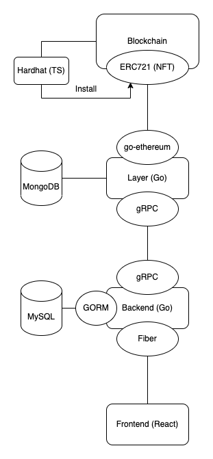

# clinker

Clinker is a Blockchain-linked community system. It's composed of several components.

The community system is provided as a web application.

## Composition

## Flow

### user

### vestige, appraisal

More information can be checked in each component's folder.
