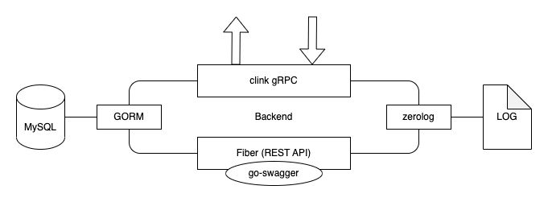
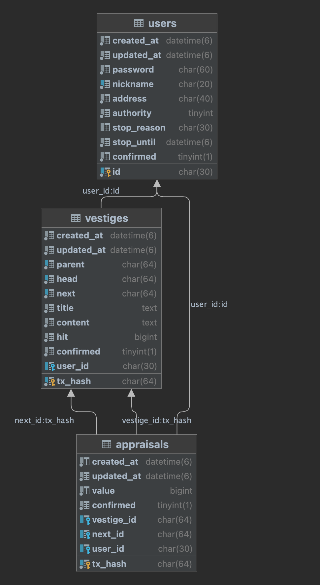

# Backend

`Backend` administrates data from users and provides REST API to the clients.

## Composition



- Go 1.19
- Fiber web framework
- go-swagger
- fiber-jwt
- GORM
- MySQL
- gRPC

## Database



## Requirements

Need to make `.env` file with formatting like `.env.example`.

```
go run main.go
```
