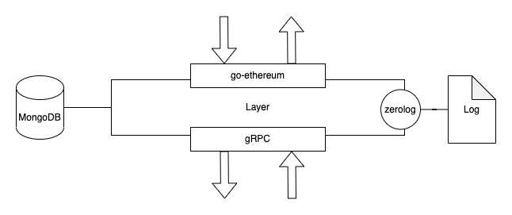
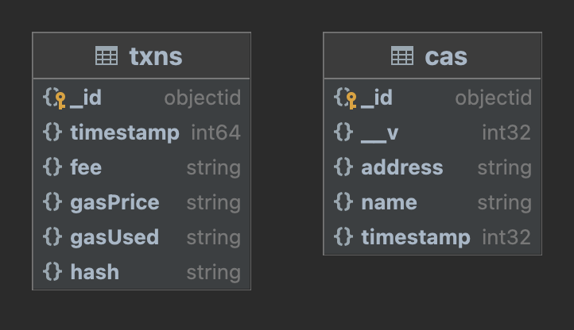

## Layer

`Layer` communicates with other components using gRPC and contacts to the blockchain directly.

When after sending a transaction, `Layer` saves its gas information.

`Layer` loads ERC721 CA from MongoDB inserted by `Contract` component.

## Composition



- Go 1.19
- gRPC
- go-ethereum
- mongo-go-driver
- MongoDB

## Database



## Requirements

Need to make `.env` file with formatting like `.env.example`.

```
go run main.go
```
